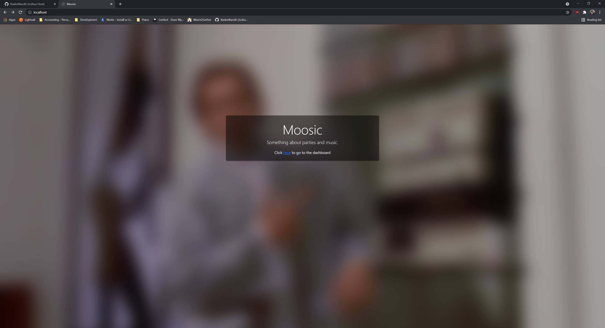

# Moosic
A lightweight [Java + Spring](https://spring.io/) HTTP audio streaming application that allows you to play from a single source but queue from multiple.
Hosted via Localhost, users connect to the embedded HTTP server at [http://localhost:8080](http://localhost:8080) and are presented with a webpage for queueing tracks from a number of HTTP sources and a dashboard for monitoring/control. 

### Installation

#### Prerequisites
- Windows 10/11 [Untested on Linux/MacOS]
- [Java 16](https://jdk.java.net/16/)

#### Instructions
<ol>
    <li>Download this <a href="https://github.com/BasketBandit/Moosic/archive/refs/heads/main.zip">repository</a> and unzip it anywhere.</li>
    <li>To launch the application, either:</li>
        <ol>
            <li>Double click <code>Moosic.bat</code></li>
            <li>Navigate to <code>/build/libs</code>, open a terminal and run <code>java -Dserver-port=80 -jar moosic-[version].jar</code>. (feel free to change ports)</li>
        </ol>
    <li>Navigate to <a href="http://localhost:8080">localhost:8080</a> in your favourite browser to start.</li>
    <li>To stop the application, either:</li>
        <ol>
            <li>Push the close button. (red x)</li>
            <li>Key <code>CTRL + C</code> in the terminal window.</li>
        </ol>
</ol>

### Support
[LavaPlayer](https://github.com/sedmelluq/lavaplayer) the audio player library Moosic is based upon supports a number of HTTP sources, there are the ones that have been enabled:
- YouTube
- SoundCloud
- Bandcamp
- Vimeo
- Twitch streams

Most HTTP audio source are also supported but your mileage may vary.

### Display
Here are some screenshots of how Moosic currently looks, I will try to keep these screenshots accurate to the current state of the project.

